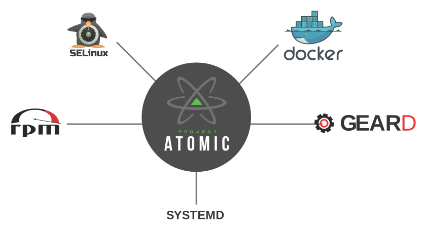

Project Atomic - geard, SELinux, Atomic, Docker, systemd. Project Atomic and Docker are very fast moving technologies at the moment.  There is a already lot of existing documentation out there.  This lab attempts to consolidate some of that documentation and provide a comprehensive example of an end to end deployment using Project Atomic components. The goal is to have a systems administrator deploy a Red Hat Enterprise Linux Atomic Host build server and compose some trees.  Then, the admin would deploy a couple of Atomic Hosts and consume those trees.  After that is done, we'll move into some Docker and geard basics and wrap up with a Red Hat Enterprise Linux Atomic host rollback.  This should introduce you to all the components in the Project Atomic container ecosystem. 

